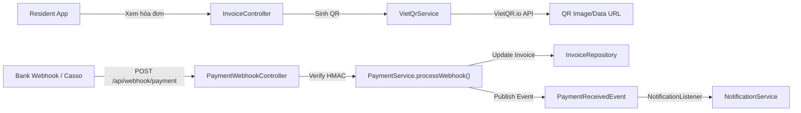
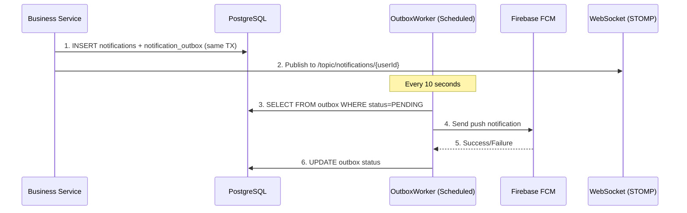

# Payment (VietQR) & Notification Module Implementation Plan

## Tổng quan

Implement 2 module còn thiếu cho hệ thống Smart Room Rental SaaS:

1. **Payment Module** — Tăng cường module `finance` hiện có với VietQR QR code generation, webhook processing hoàn chỉnh, và bank config management.
2. **Notification Module** — Module mới hoàn toàn (`modules/notification`) theo Transactional Outbox pattern với Firebase FCM push + in-app notifications qua WebSocket (SockJS/STOMP).

> [!IMPORTANT]
> Project chạy trên VPS 2 vCPU / 2GB RAM, budget $0. Tất cả công nghệ chọn đều phải miễn phí hoặc dùng free tier.

---

## User Review Required

> [!IMPORTANT]
> **VietQR Provider**: Plan này dùng [VietQR.io API](https://vietqr.io/) (miễn phí) để sinh mã QR tĩnh (Static QR). Đối với webhook tự động nhận biến động số dư, bạn cần tích hợp với một **Bank Gateway** (ví dụ: Casso.vn free tier 3 tài khoản, hoặc SePay.vn free 1 tài khoản). Bạn muốn dùng provider nào cho webhook?

> [!WARNING]
> **Firebase FCM**: Plan này sử dụng Firebase Cloud Messaging (free tier unlimited). Bạn đã có Firebase project chưa? Nếu chưa, tôi sẽ thêm bước setup `firebase-admin` SDK và hướng dẫn tạo project.

> [!IMPORTANT]
> **WebSocket cho real-time notification**: Plan dùng Spring Boot built-in WebSocket + STOMP + SockJS (không cần dependency mới ngoài `spring-boot-starter-websocket`). Frontend sẽ dùng `@stomp/stompjs`. Bạn đồng ý approach này không?

---

## Open Questions

1. **Bank account info**: Quản lý sẽ config thông tin ngân hàng (tên TK, số TK, mã ngân hàng) ở đâu? Plan này đề xuất thêm vào `workspace_configs` (JSONB) hoặc tạo bảng riêng `bank_accounts`. Bạn thích cách nào?

2. **Email notification**: SRS có nhắc đến Email/Zalo. Project đã có `spring-boot-starter-mail` trong `pom.xml`. Bạn có muốn implement Email notification channel cùng lúc không, hay chỉ FCM + In-app trước?

3. **Notification cho Resident mobile**: Resident truy cập qua PWA hay native app? Điều này ảnh hưởng cách đăng ký FCM token.

---

## Proposed Changes

### Phase 1: Payment Module Enhancement (Backend)

#### Kiến trúc



---

#### [NEW] `VietQrService.java` — VietQR QR Code Generation

**Path:** `modules/finance/application/service/VietQrService.java`

Tạo service mới sinh mã VietQR theo chuẩn NAPAS 247:
- Nhận input: `bankBin`, `accountNumber`, `accountName`, `amount`, `memo` (chứa `INV-{id}`)
- Gọi VietQR.io API `POST https://api.vietqr.io/v2/generate` để lấy QR image (Base64)
- Fallback: tự sinh QR string theo chuẩn EMVCo nếu API không khả dụng
- Cache QR trong Redis (TTL 15 phút) để tránh gọi API lặp

```java
public record VietQrResult(
    String qrDataUrl,      // base64 QR image 
    String qrRawContent,   // EMVCo string for client-side rendering
    String memo,           // "INV-{invoiceId}"
    BigDecimal amount,
    String accountName,
    String bankName
) {}
```

#### [NEW] `VietQrConfig.java` — Configuration Properties

**Path:** `modules/finance/infrastructure/config/VietQrConfig.java`

```java
@ConfigurationProperties(prefix = "app.vietqr")
public record VietQrConfig(
    String apiUrl,          // https://api.vietqr.io/v2/generate
    String clientId,        // VietQR.io client ID  
    String apiKey,          // VietQR.io API key
    String webhookSecret    // HMAC secret from Casso/SePay
) {}
```

#### [MODIFY] [PaymentController.java](file:///d:/DH/UIT/Nam%203%20-%20HK%20II/DoAn1/Project/DoAn1-RentalManagement/backend/src/main/java/com/roomrental/modules/finance/interfaces/rest/controller/PaymentController.java)

Thêm endpoints:
- `GET /api/v1/payments/vietqr/{invoiceId}` — Sinh VietQR cho hóa đơn cụ thể (UC75/UC78)
- `POST /api/v1/payments/webhook` — Public endpoint nhận webhook từ bank (không cần JWT, verify bằng HMAC signature)

#### [NEW] `PaymentWebhookController.java` — Public Webhook Endpoint

**Path:** `modules/finance/interfaces/rest/controller/PaymentWebhookController.java`

Controller riêng biệt cho webhook (không nằm trong security filter chain):
- Verify HMAC-SHA256 signature từ header
- IP whitelist (optional)
- Gọi `PaymentService.processWebhook()`
- Luôn trả 200 OK (webhook best practice)

#### [MODIFY] [PaymentService.java](file:///d:/DH/UIT/Nam%203%20-%20HK%20II/DoAn1/Project/DoAn1-RentalManagement/backend/src/main/java/com/roomrental/modules/finance/application/service/PaymentService.java)

Cải thiện `processWebhook()`:
- Thêm HMAC signature verification
- Sau khi xử lý thành công → publish `PaymentCompletedNotificationEvent` (cho Notification module lắng nghe)
- Xử lý edge case: duplicate webhook (idempotency đã có), invoice VOID check

#### [NEW] Flyway Migration `V23__add_bank_config_and_notification_tables.sql`

**Path:** `backend/src/main/resources/db/migration/V23__add_bank_config_and_notification_tables.sql`

```sql
-- Bank configuration per tenant (for VietQR generation)
ALTER TABLE workspace_configs ADD COLUMN IF NOT EXISTS bank_config JSONB;
-- JSONB structure: { "bankBin": "970422", "accountNumber": "123456", 
--                    "accountName": "NGUYEN VAN A", "bankName": "MB Bank" }

-- Add tenant_id to notifications table (multi-tenancy compliance)
ALTER TABLE notifications ADD COLUMN IF NOT EXISTS tenant_id UUID REFERENCES tenants(id);

-- Add notification type expansion
ALTER TABLE notifications DROP CONSTRAINT IF EXISTS notifications_type_check;
ALTER TABLE notifications ADD CONSTRAINT notifications_type_check 
    CHECK (type IN ('SYSTEM','REMINDER','MAINTENANCE','CONTRACT','BILLING','PAYMENT','GENERAL'));

-- Device tokens for FCM push
CREATE TABLE IF NOT EXISTS device_tokens (
    id         BIGSERIAL PRIMARY KEY,
    user_id    UUID NOT NULL REFERENCES users(id) ON DELETE CASCADE,
    token      TEXT NOT NULL,
    device_type VARCHAR(20) NOT NULL CHECK (device_type IN ('WEB','ANDROID','IOS')),
    is_active  BOOLEAN NOT NULL DEFAULT TRUE,
    created_at TIMESTAMP NOT NULL DEFAULT CURRENT_TIMESTAMP,
    updated_at TIMESTAMP,
    CONSTRAINT device_tokens_user_token_unique UNIQUE (user_id, token)
);
CREATE INDEX IF NOT EXISTS idx_device_tokens_user ON device_tokens(user_id);

-- Notification outbox for reliable delivery
CREATE TABLE IF NOT EXISTS notification_outbox (
    id              BIGSERIAL PRIMARY KEY,
    notification_id BIGINT REFERENCES notifications(id),
    channel         VARCHAR(20) NOT NULL CHECK (channel IN ('FCM','EMAIL','WEBSOCKET')),
    payload         JSONB NOT NULL,
    status          VARCHAR(20) NOT NULL DEFAULT 'PENDING'
                    CHECK (status IN ('PENDING','SENT','FAILED','RETRY')),
    retry_count     INT NOT NULL DEFAULT 0,
    max_retries     INT NOT NULL DEFAULT 3,
    next_retry_at   TIMESTAMP,
    created_at      TIMESTAMP NOT NULL DEFAULT CURRENT_TIMESTAMP,
    processed_at    TIMESTAMP
);
CREATE INDEX IF NOT EXISTS idx_outbox_status ON notification_outbox(status);
CREATE INDEX IF NOT EXISTS idx_outbox_next_retry ON notification_outbox(next_retry_at);
```

#### [MODIFY] `.env.example`

Thêm env vars mới:
```env
# --- VietQR ---
VIETQR_API_URL=https://api.vietqr.io/v2/generate
VIETQR_CLIENT_ID=your_client_id
VIETQR_API_KEY=your_api_key
VIETQR_WEBHOOK_SECRET=your_webhook_hmac_secret

# --- Firebase (FCM Push Notification) ---
FIREBASE_CREDENTIALS_PATH=gcp-credentials.json/firebase-service-account.json
```

---

### Phase 2: Notification Module (Backend — New Module)

#### Kiến trúc Transactional Outbox



---

#### [NEW] Module `notification` — Full Clean Architecture

```
modules/notification/
├── domain/
│   ├── model/
│   │   ├── Notification.java          # Domain model
│   │   ├── NotificationOutbox.java    # Outbox domain model
│   │   ├── DeviceToken.java           # FCM device token
│   │   └── NotificationType.java      # Enum: SYSTEM, BILLING, PAYMENT, etc.
│   └── repository/
│       ├── NotificationRepository.java
│       ├── NotificationOutboxRepository.java
│       └── DeviceTokenRepository.java
├── application/
│   ├── service/
│   │   ├── NotificationService.java       # Core: create + persist + publish WS
│   │   ├── NotificationQueryService.java  # Read: list, count unread, mark read
│   │   └── PushNotificationService.java   # FCM push via firebase-admin SDK
│   ├── dto/
│   │   ├── NotificationResult.java
│   │   ├── CreateNotificationCommand.java
│   │   ├── BroadcastNotificationCommand.java
│   │   └── UnreadCountResult.java
│   ├── event/
│   │   └── NotificationEventListener.java # Listens to PaymentReceivedEvent, InvoiceCreatedEvent, etc.
│   └── scheduler/
│       └── OutboxProcessor.java           # @Scheduled: poll outbox, send FCM, retry
├── infrastructure/
│   ├── persistence/
│   │   ├── NotificationEntity.java
│   │   ├── NotificationOutboxEntity.java
│   │   ├── DeviceTokenEntity.java
│   │   ├── JpaNotificationRepository.java
│   │   ├── JpaNotificationOutboxRepository.java
│   │   └── JpaDeviceTokenRepository.java
│   └── firebase/
│       └── FirebaseMessagingAdapter.java  # Firebase Admin SDK wrapper
└── interfaces/
    └── rest/
        ├── controller/
        │   ├── NotificationController.java    # UC88, UC89: list, mark read
        │   └── DeviceTokenController.java     # Register/unregister FCM token
        └── dto/
            ├── RegisterTokenRequest.java
            └── BroadcastRequest.java
```

#### Key Classes Detail:

**`NotificationService.java`** — Core logic:
```java
@Transactional
public void send(CreateNotificationCommand cmd) {
    // 1. Save notification to DB
    // 2. Save outbox entry (FCM channel) 
    // 3. Send WebSocket message immediately (best-effort real-time)
}

@Transactional  
public void broadcast(BroadcastNotificationCommand cmd) {
    // UC87: Bulk insert notifications for all active residents in scope
    // Batch insert optimization (BR87.3)
}
```

**`NotificationEventListener.java`** — Event-driven bridge:
```java
@Component
public class NotificationEventListener {
    
    @Async
    @TransactionalEventListener(phase = AFTER_COMMIT)
    public void onPaymentReceived(PaymentReceivedEvent event) {
        // Template: "Hóa đơn #{invoiceId} đã nhận {amount}đ"
        // Send to: Manager + Resident
    }
    
    @Async  
    @TransactionalEventListener(phase = AFTER_COMMIT)
    public void onInvoiceCreated(InvoiceCreatedEvent event) {
        // Template: "Hóa đơn tháng {month} đã được tạo"
        // Send to: Resident
    }
}
```

**`OutboxProcessor.java`** — Reliable delivery:
```java
@Scheduled(fixedDelay = 10_000) // Every 10 seconds
public void processOutbox() {
    // 1. Fetch PENDING + RETRY entries (limit 50)
    // 2. Send via FCM
    // 3. Update status (SENT/FAILED)
    // 4. Exponential backoff for retries (BR86.6)
}
```

#### [NEW] WebSocket Configuration

**Path:** `common/config/WebSocketConfig.java`

```java
@Configuration
@EnableWebSocketMessageBroker
public class WebSocketConfig implements WebSocketMessageBrokerConfigurer {
    @Override
    public void configureMessageBroker(MessageBrokerRegistry config) {
        config.enableSimpleBroker("/topic", "/queue");
        config.setApplicationDestinationPrefixes("/app");
    }
    
    @Override
    public void registerStompEndpoints(StompEndpointRegistry registry) {
        registry.addEndpoint("/ws")
                .setAllowedOriginPatterns("*")
                .withSockJS();
    }
}
```

Notifications sẽ được push tới channel: `/queue/notifications-{userId}`

#### [MODIFY] [pom.xml](file:///d:/DH/UIT/Nam%203%20-%20HK%20II/DoAn1/Project/DoAn1-RentalManagement/backend/pom.xml)

Thêm dependencies:
```xml
<!-- WebSocket -->
<dependency>
    <groupId>org.springframework.boot</groupId>
    <artifactId>spring-boot-starter-websocket</artifactId>
</dependency>

<!-- Firebase Admin SDK -->
<dependency>
    <groupId>com.google.firebase</groupId>
    <artifactId>firebase-admin</artifactId>
    <version>9.4.3</version>
</dependency>
```

#### [MODIFY] Security Config

Thêm vào whitelist:
- `/api/v1/payments/webhook` — Public (webhook từ bank)
- `/ws/**` — WebSocket endpoint (auth qua STOMP headers)

---

### Phase 3: Notification Auto-Clean (UC88 BR121)

#### [NEW] `NotificationCleanupScheduler.java`

**Path:** `modules/notification/application/scheduler/NotificationCleanupScheduler.java`

```java
@Scheduled(cron = "0 0 3 * * *") // Daily at 3 AM
public void cleanOldNotifications() {
    // Delete notifications where is_read=true AND read_at < 30 days ago
    // Batch delete (100 records per iteration) to avoid table lock (BR89.6)
}
```

---

### Phase 4: Frontend Integration

#### [NEW] Feature `notifications` 

**Path:** `frontend/src/features/notifications/`

```
notifications/
├── components/
│   ├── NotificationBell.tsx         # Bell icon + unread badge (Navbar)
│   ├── NotificationDropdown.tsx     # Dropdown list khi click bell
│   ├── NotificationItem.tsx         # Single notification card
│   └── BroadcastModal.tsx           # Manager: soạn thông báo chung (UC87)
├── pages/
│   └── NotificationListPage.tsx     # Full page list (UC88)
├── hooks/
│   ├── useNotifications.ts          # React Query: fetch notifications
│   ├── useUnreadCount.ts            # React Query: unread count
│   └── useWebSocket.ts             # STOMP WebSocket connection
└── api/
    └── notificationApi.ts           # Axios API client
```

#### [NEW] Feature `payments` enhancement

**Path:** `frontend/src/features/invoices/components/`

```
invoices/components/
├── VietQrPaymentModal.tsx          # Modal hiển thị mã QR + thông tin thanh toán
├── PaymentStatusBadge.tsx          # Badge hiển thị PENDING/PARTIAL/PAID
└── TransactionHistoryTable.tsx     # Bảng lịch sử giao dịch (UC79)
```

**`VietQrPaymentModal.tsx`** — Core UX:
- Gọi API `GET /api/v1/payments/vietqr/{invoiceId}` 
- Hiển thị QR code image (từ base64)
- Hiển thị thông tin: Ngân hàng, Số tài khoản, Số tiền, Nội dung CK
- Auto-refresh trạng thái hóa đơn qua WebSocket (khi webhook arrive)
- Nút "Copy nội dung chuyển khoản" cho mobile users

#### [MODIFY] Layout/Header component

Thêm `NotificationBell` component vào Header/Navbar hiện tại.

---

## Tóm tắt Files Thay Đổi

| Action | Layer | File | Mô tả |
|--------|-------|------|--------|
| NEW | Backend | `V23__add_bank_config_and_notification_tables.sql` | DB migration |
| NEW | Backend | `modules/notification/**` | Toàn bộ notification module |
| NEW | Backend | `VietQrService.java` | VietQR code generation |
| NEW | Backend | `VietQrConfig.java` | Config properties |
| NEW | Backend | `PaymentWebhookController.java` | Public webhook endpoint |
| NEW | Backend | `common/config/WebSocketConfig.java` | WebSocket/STOMP config |
| MODIFY | Backend | `PaymentService.java` | HMAC verify, notification event |
| MODIFY | Backend | `PaymentController.java` | QR endpoint |
| MODIFY | Backend | `pom.xml` | WebSocket + Firebase deps |
| MODIFY | Backend | `SecurityConfig` | Whitelist webhook + WS |
| MODIFY | Backend | `.env.example` | VietQR + Firebase env vars |
| NEW | Frontend | `features/notifications/**` | Notification UI |
| NEW | Frontend | `VietQrPaymentModal.tsx` | QR payment modal |
| MODIFY | Frontend | Header/Layout | NotificationBell integration |

---

## Verification Plan

### Automated Tests
```bash
# Backend unit tests
./mvnw test -pl backend -Dtest="*NotificationService*,*PaymentService*,*VietQr*"

# Integration test with Testcontainers (PostgreSQL)
./mvnw verify -pl backend -Dtest="*IntegrationTest*"
```

- `NotificationServiceTest` — Test create, broadcast, mark-read, unread count
- `PaymentServiceTest` — Test webhook processing, HMAC verification, idempotency
- `VietQrServiceTest` — Test QR generation, memo format `INV-{id}`
- `OutboxProcessorTest` — Test retry logic, exponential backoff
- `NotificationEventListenerTest` — Test event → notification creation

### Manual Verification
1. Swagger UI: Gọi `/api/v1/payments/vietqr/{invoiceId}` → verify QR image hiển thị đúng
2. Simulate webhook: `POST /api/v1/payments/test/webhook-simulate` → verify invoice status update + notification created
3. WebSocket: Mở browser console, connect STOMP → verify real-time notification push
4. Frontend: Click bell icon → verify dropdown hiển thị notifications
5. VietQR modal: Mở invoice detail → click "Thanh toán QR" → verify QR hiển thị đúng thông tin

---

## Thứ tự Implementation

1. **DB Migration** (V23) — Schema changes
2. **Notification Module** (Backend) — Domain → Application → Infrastructure → Interfaces  
3. **VietQR Service** (Backend) — QR generation + webhook enhancement
4. **WebSocket Config** — Real-time push setup
5. **Notification Event Listener** — Bridge existing events → notifications
6. **Outbox Processor** — Reliable FCM delivery
7. **Frontend: NotificationBell + Dropdown** — In-app notifications
8. **Frontend: VietQR Payment Modal** — QR payment UX
9. **Tests** — Unit + integration tests
10. **Cleanup Scheduler** — Auto-clean old notifications
